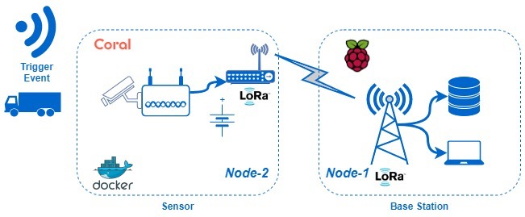

# SB LoRa link 
This directory conrtains all of the code and documentation for the LoRa alerting link

## Hardware
Adafruit Feather M0 RFM9x radio modules are used for the Long Range (LoRa) radio link
to send alert messages. 

## Software
Arduino IDE was used to compile and download all code used for the Feather LoRa modules.

## Architecture

The remote sensing unit is referred to as Node-2 and the base receiving unit is referred to
as Node-1. Alerts generally originate at Node-2 sensors and are transmitted back to a central
Node-1 sensor (or sensors). There can be up to n Node-2 sensors deployed at any one time. 
Usually there will be one central Node-1 for up to n Node-2 sensors. Note: there are no reliablilty
mechanisms such as retry, hARQ, ACK/NACK, etc... as you would see in TCP/IP, for example. The LoRa protocol uses
forward error correction (FEC) to detect and correct some bit errors, but nothing beyond this. See 
the diagram below.

## Concept of Operation

The remote sensor Node-2 will generate alerts originating from a detect.py script running and 
processing images from an IP camera. These alerts are then formatted and sent to the LoRa radio
via a serial port (usually /dev/ttyACMx) on the local device. The Node-2 LoRa radio will poll its serial 
port for these messages and then forward them over the LoRa radio link to the Node-1 base receiver. The
base reciever will then recieve these radio messages and forward them to the appropriate bus (serial, SPI, 
I2C, etc...) where they can be processed or evaluated.

