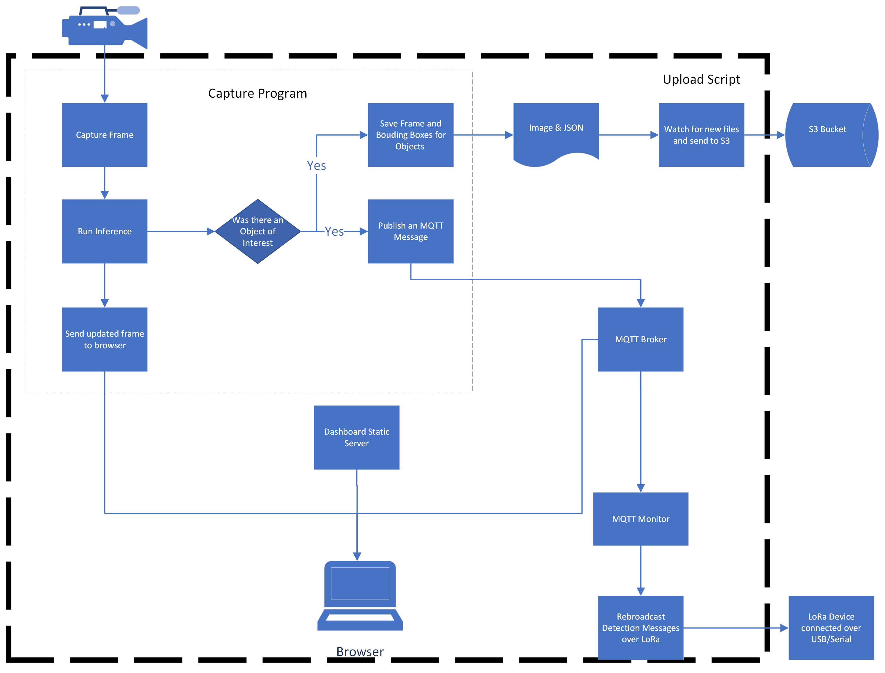

# EyeQT
## Object detection at the edge, with Google's Coral dev board

Are you interested in using an inexpensive, low-power embedded device to perform object detection in remote locations and monitor this system wirelessly? For instance, you might want to determine if a raccoon is rummaging in your trash. EyeQT can help!

For a few hundred USD and moderate programming skills, you can 
(a) build your own computer vision models that perform object detection as well as identify an object and its location in the image
(b) deploy these models to a low-cost computer called the [Google Coral Dev Board](https://coral.ai/products/dev-board) and 
(c) use a simple web interface to monitor the images collected.

This repository provides the code and the necessary explanation for you to build EyeQT by yourself.

EyeQT is an exploration of a current trend in computing and artificial intelligence research: performing machine learning inference on "edge" devices. These devices are designed to balance compute with power effiency and cost, allowing for Machine Learning (ML) to be used in new environments. Since the ML model runs completely on the device and not on a desktop machine or server, it can work without an Internet connection and can provide answers in milliseconds. This low-latency allows for ML to be part of a machines decision process in the field.


### EyeQT Capabilities
- Use a generic object detection model to capture images of a general class of objects. This runs completely on the Coral Board, allowing for this capture to happen in a remote location.
- After a custom Object Detection model has been created, it can be run on the Coral Board and images will be saved of the object of interested.
- Flags can be set to prevent images from being captured when certain objects are in the frame, such as people.
- If the Coral board is connected to a network, a web frontend lets you monitor the camera view and what objects have been detected.
- When objects are detected, it can be announced over [MQTT](https://mqtt.org/) if there is a network connection, or over [LoRa](https://lora-alliance.org/) if the device is in a remote location.


### Requirements
Estimated Cost: $250
Estimated Duration of Set Up and Troubleshooting: 10 hours
Required Hardware:
- [Google Coral Dev Board](https://coral.ai/products/dev-board)
- Camera - *OpenCV is used under the hood and we have tested it with the following cameras*
    - [Coral Camera](https://coral.ai/products/camera)
    - [Ubiquiti G3 Pro](https://www.ui.com/unifi-video/unifi-video-camera-g3-pro/)
    - *In theory, it should work with any USB or RTSP IP Camera*
- Required skill: Comfortable with navigating, executing commands, and understanding errors in a Linux or MacOS terminal 


*Refer to the EyeQT Hardware repo for potential configurations*


### Components


### 📁 Folders 
- **archive** - folder where images/json will go after being upload to S3
- **capture** - folder where images/json are saved after being created. *s3upload* will automatically upload all files from here to S3
- **[dashboard](dashboard/README.md)** - React-based frontend. Changes here need to be packaged into static code and copied into dashboard-serve
- **[dashboard-serve](dashboard-serve/README.md)** - NGINX proxy that serves up a static version of the React dashboard and also passes connections to the video feed from the *detect* program
- **[detect](detect/README.md)** - Python program that looks for objects and saves files when they are detected
- **mqtt** - The Dockerfile for the MQTT server. The configuration needs to be customized to allow for MQTT over websockets
- **[relay](relay/README.md)** - Copies MQTT messages from a local broker to a public broker on the Internet. *This is an optional component.*
- **[s3upload](s3upload/README.md)** - Python program that watches folders and automatically uploads to S3 and archives the files. *This is an optional component.*
- **[experiments](experiments/README.md)** - Python utility for running a trained model in the TFlite format against a folder of images. It will generate images with bounding box overlays for the objects it detects.
- **[LoRa-alerts](LoRa-alerts/README.md)** - Arduino program that allows for an Adafruit M0 LoRa Feather to be attached to the Coral USB and relay messages over LoRa.
- **monitor** - Python program that subscribes to the MQTT broker and sends messages it receives out of LoRa. 

### 📦 Containers
There are 3 containers that get built via the docker-compose file:
- **watchtower** - This downloads and brings up new containers when they are available
- **s3upload** - Runs the s3upload program
- **detect** - Runs the detect program
- **dashboard** - The NGINX proxy server (from the dashboard-serve folder above)
- **mqtt** - Local MQTT broker 
- **monitor** - Sends MQTT messages out over LoRa

## Installation 

Configure the Coral Board, following the directions from [Google](https://coral.ai/docs/dev-board/get-started/). Get the Coral Board on the network and SSH over to it. On the Coral Board, perform the following steps:

1. `sudo mkdir /usr/local/eyeqt`

2. `sudo chown mendel:mendel /usr/local/eyeqt`

# TODO: Remove stakeout box from this code below. What is the correct code?
3. `git clone https://github.com/IQTLabs/EyeQT-Software.git /usr/local/eyeqt`

4. `cd /usr/local/eyeqt`

5. `chmod 755 *.sh`

6. `sudo ./00-prepareEnvironment.sh`

#### Configure

1. Edit the final line of the docker-compose.yml for the parameters you use for running the capture program. For example, `python3 detect.py --videosrc=net --netsrc=rtsp://192.168.1.7:7447/poJLP0wxMlbW5thN --top_k=10 --threshold=0.60 --include=truck`

#### Optional configuration for S3 image upload

1. `sudo nano /etc/environment`

2. Add the following variables to the file: 
````
ACCESS_KEY=<AWS Access Key for S3 bucket>
SECRET_KEY=<AWS Secret Key for S3 bucket>
````

3. Save the file and reboot the Coral Board.

5. Confirm that `ACCESS_KEY` and `SECRET_KEY` are in in the environment by typing `env`.
 

#### Build Docker Containers

1. `docker-compose build`


#### Run
To watch output: `docker-compose up`

To run as a daemon: `docker-compose up -d`

#### View Dashboard
On a separate computer, enter the Coral Boards IP address in a browser to view the dashboard.

### 🗂MQTT Topics

**eyeqt/[unit id]/detection** 
Sent every time an object of interest is detected. The message contains a JSON object, listing all of the objects detected in a frame. The Key `objects` is an array of strings listing all of the objects currently detected. 

Example message:
````
{  "objects": ['object1', 'object2', 'object3']}
````

**eyeqt/[unit id]/detection-count** 
Sent every 10 seconds. The message contains a JSON object with a count of how many of each type of object has been detected in a frame. In the message, each object type is a key and the value is the number of those objects detected in the frame.

Example message:
````
{
    'cat': 1,
    'dog': 2
}
````

**eyeqt/[unit id]/detection-image**
Sent every time an object of interest is detected. The message contains a small jpeg of the image where the object of interest was detected. It is an array of bytes. The `dashboard/src/Dashboard.js` file has an example of how to decode and display this file.
